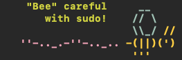

# Setting up a custom lecture file

## Step one: selecting your lecture text

Before you can set up a custom sudo lecture, you have to figure out what you want your lecture to be. I personally like this punny option, but there are others available online, or you can make your own.

```
^[[0m    ^[[1;32m"Bee" careful     ^[[1;34m__
       ^[[1;32mwith sudo!    ^[[1;34m// \
                     \\_/ ^[[1;33m//
   ^[[1;35m''-.._.-''-.._.. ^[[1;33m-(||)(')
                     '''^[[0m
```

That may look like a jumbled mess, but when you run sudo, it looks like this:



## Step two: copying the lecture to a file

The default path for the lecture file is `/etc/sudoers.lecture`, and copying your lecture text to that path with your favorite text editor may be enough, but if that doesn't work or you want to put it in a custom path, you may need to edit your sudo configuration.

## (Optional) Step three: editing sudo configuration

You can edit your sudo config with the command `sudo visudo`, which will open the sudo configuration with the vi text editor. This can be a little tricky to navigate, but what we're doing is pretty simple. The two lines we care about look like this:

```
Defaults        lecture=always
Defaults        lecture_file = "/etc/sudoers.lecture"
```

The first line will determine whether or not we see our lecture file when we run a command with sudo. If you only want it to lecture you the first time you use sudo, set the value to `lecture=once`. If you want to see your lecture every time, set it to `lecture=always`.

The second one determines where your lecture file should be. You can set this to any path on the system, mine is set to `lecture_file = "/etc/sudo_lecture"`.

To edit the file, navigate to the line with your arrow keys and press "i" on your keyboard. This will enter the vi "INSERT" mode, for entering text. Use your arrow keys to navigate and enter text normally. When you're finished editing the file, press escape to exit insert mode, and type ":wq" and press enter. This will tell vi to save your changes and exit.